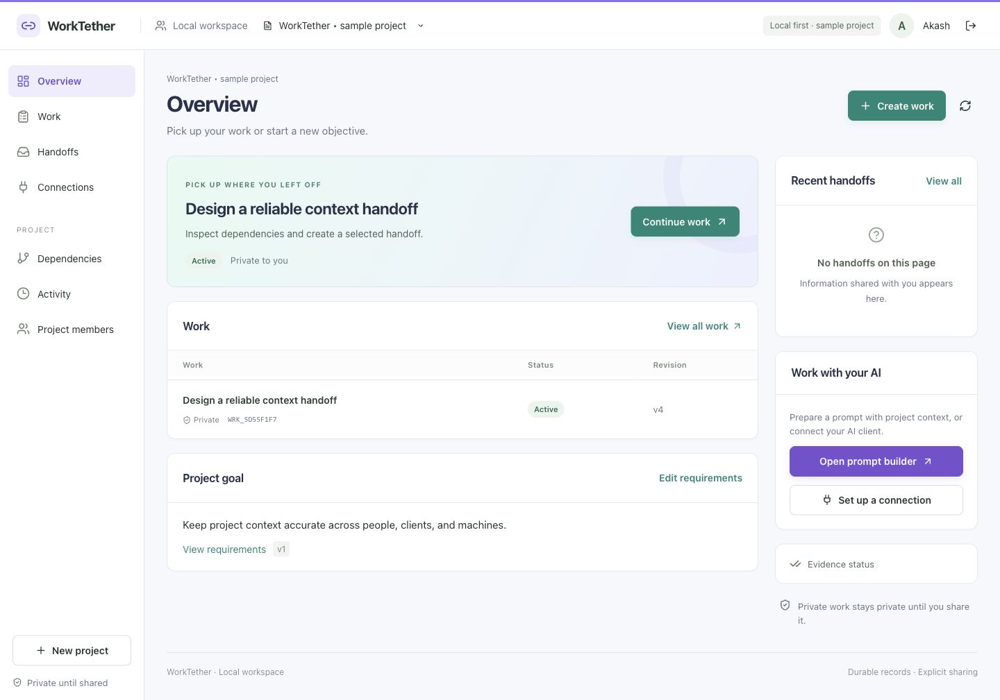
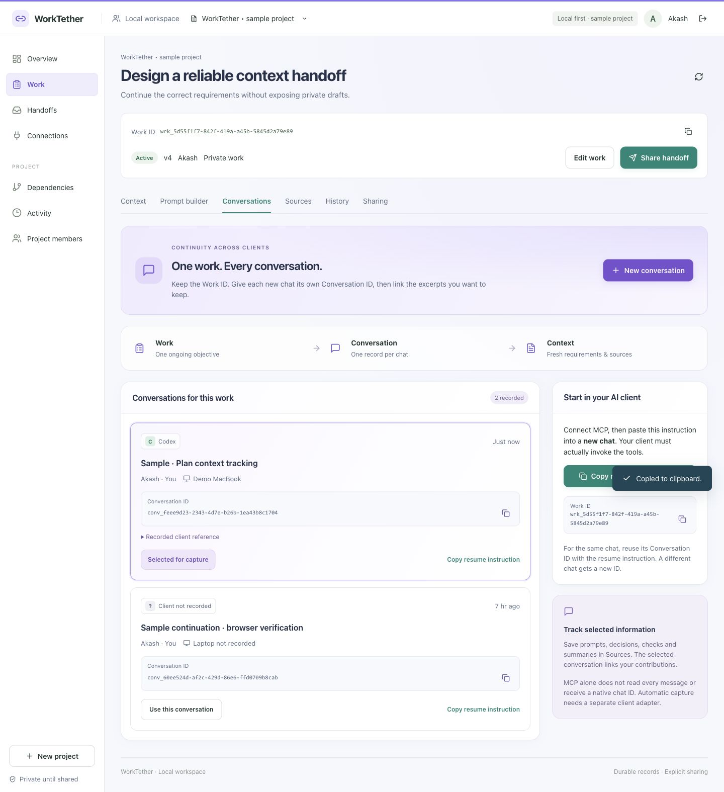

# WorkTether

Keep project requirements, useful sources, and next steps together across AI conversations. WorkTether runs locally, gives each work item a stable ID, and connects Codex, Cursor, and Claude through authenticated MCP tools.

Work is private by default. Share selected handoffs or grant work access deliberately. The new **Prompt builder** preserves your request and adds current project context for you to inspect and copy.

**Deploy or connect from another system:** follow the [step-by-step deployment and MCP guide](docs/deploy.md). Local MCP is implemented; public HTTPS hosting and per-person OAuth remain a separate implementation milestone.



## Project agenda

1. **Now:** run locally, keep stable work IDs, review context and prepare prompts, and share selected handoffs.
2. **Next:** verify workflows inside the actual Codex, Cursor, and Claude clients, then evaluate prompt quality on representative tasks.
3. **Later:** add secure shared hosting for many people and machines, opt-in native adapters, and GitHub integration. See the [roadmap](docs/ROADMAP.md) for release gates.

## Run locally

Requires **Node.js 22.13 or newer** with `node:sqlite`. Run these commands from the `WorkTether` folder:

```sh
npm ci
npm run build
npm start
```

Open [WorkTether](http://127.0.0.1:4318). Keep the server running while using the dashboard or MCP. The default MCP endpoint is `http://127.0.0.1:4318/mcp`.

For development, use `npm run dev` and open `http://127.0.0.1:5173`. After production source changes, rebuild and restart. The verified Node 22.23.1 runtime prints an experimental SQLite warning.

An empty database includes these sample accounts, all using password `worktether-local-2026`:

- `akash@worktether.local`
- `maya@worktether.local`
- `ravi@worktether.local`

Samples are examples. Create your own account and project for actual work. To start without samples, set `WORKTETHER_SEED=false` with a **new** database path; this does not delete existing records.

## Connect your AI client

1. Sign in as yourself. Open **Connections** and choose **Create setup credential**. Copy it when shown.
2. In a second terminal, from the WorkTether folder, run the following command and paste the credential at its hidden prompt.
3. Open and trust this folder in your client, reconnect MCP, and verify that the returned workspace belongs to your account.

```sh
npm run setup:mcp -- --client all --machine-name "Akash MacBook"
```

Choose one client with `--client codex`, `cursor`, `claude-code`, or `claude-desktop`.

Run setup **on the laptop that launches the client**. Change the laptop label to your own name, or omit `--machine-name`. Connections can build the command for you. The label identifies registrations; it does not lock credentials to hardware. The [laptop setup guide](docs/LAPTOP_SETUP.md) covers macOS/Windows, custom ports, another repository, and the shared-hosting boundary.

| Client | Setup writes |
| --- | --- |
| Codex | `.codex/config.toml` |
| Cursor | `.cursor/mcp.json` |
| Claude Code | `.mcp.json` |
| Claude Desktop | `.worktether/claude-desktop-config.json` — merge its entry into Desktop's local config and restart |

Setup provisions a separate registration and credential for each selected client. You do not need to register clients manually first. After successful setup, you may revoke the setup credential; the new client credentials are separate.

The generated configurations use absolute local paths. Personal plaintext credentials live in ignored `.worktether/connections/` files with restricted POSIX permissions; Windows protection depends on folder ACLs. Never commit or share that directory. Setup preserves other server entries and refuses conflicting configurations or existing credential files. Configuration-only templates still require activation.

See the [integration guide](docs/INTEGRATIONS.md) for Desktop's merge step, direct HTTP configuration, custom ports, moved folders, and recovery. SDK transport tests pass; certification inside the actual Codex, Cursor, and Claude applications remains pending.

## Deploy for other people

Use **one shared service** to keep Work and Conversation IDs consistent across laptops, with each person using their own identity and deliberate work access.

1. Verify local setup first. The [deployment guide](docs/deploy.md#1-run-and-connect-on-one-laptop) covers installation and client connection.
2. For a small trusted group, the guide documents a [private SSH pilot](docs/deploy.md#2-private-shared-pilot-over-ssh) using the existing loopback server. That multi-machine procedure still needs verification.
3. For public use, implement the [hosted profile](docs/deploy.md#3-build-the-public-hosting-profile), including OAuth, explicit HTTPS hosts, shared storage and recovery; then follow the staging, verification and release steps.
4. Once an operator supplies a real hosted URL, users follow the [Codex, Cursor, Claude and ChatGPT connection steps](docs/deploy.md#5-connect-to-the-hosted-mcp-from-chat-or-an-editor). Direct HTTP users do not need a local backend/database.

The current release has no public deployment configuration or live public URL. Cloud chat connectors cannot reach this laptop through `127.0.0.1`. Public reachability still requires personal authorization; it does not make private records public. See [hosting architecture](docs/HOSTING.md) for migration details.

## Your first workflow

1. Create a project, record its goal and requirements, and create a work item. Keep its full **Work ID**.
2. Save useful prompts, decisions, assumptions, or evidence in **Sources**. Optionally create a WorkTether conversation to attribute selected records.
3. Open **Prompt builder**, write your request, and choose a response format. Select **Prepare prompt**.
4. Inspect the added context, warnings, omitted sources, and revisions. Confirm your review, then copy the prepared prompt into your AI client. Editors can explicitly save the original request as a proposed source.
5. Record the next step, correct or exclude unsuitable sources, and prepare fresh context before continuing. Use **Handoffs** to share selected content with a project member.

The [prompt builder guide](docs/PROMPT_BUILDER.md) explains personal draft IDs, saved-source visibility, freshness, and provenance. The **Context** view also builds readable packages with complete JSON available to inspect or copy.

Preparation runs locally without an external AI call. It adds a structured envelope; it does not rewrite meaning, automatically intercept chats, submit prompts, or verify facts. MCP installation does not supply the client's native chat ID. The [continuation template](docs/examples/continuation-instruction.md) is an optional manual instruction.

## Track each conversation

Keep the same **Work ID** for an ongoing objective. Give each **new chat** a separate **Conversation ID**; reuse that Conversation ID when resuming the same chat.

1. Open **Work → Conversations → New conversation**. Record its title and optional client/laptop labels.
2. The record is selected for your new sources and prompt drafts. Copy its **resume instruction** into the corresponding AI chat.
3. Save selected excerpts, decisions or summaries with that Conversation ID, and retrieve fresh context before continuing.
4. For a different chat/client, keep the Work ID and create another conversation. Alternatively, use **Copy new-chat instruction** to ask the connected client to create the record through MCP.



Connecting MCP alone does **not** track every message. Current tracking is explicit; automatic native chat mapping needs a separate adapter. The [conversation guide](docs/CONVERSATION_TRACKING.md) includes the tool sequence, continuation rules, diagram and future capture architecture.

## Storage and limits

Data defaults to `data/worktether.sqlite`, relative to the process working directory. Keep the database, WAL sidecars, credentials, and build output out of version control. Use SQLite online backup or stop writes before copying the database. Detailed settings are in the [environment template](docs/examples/local.env.example); the server reads process environment and does not automatically load `.env`.

The service binds to this computer's loopback address. Other physical machines can use the documented private pilot or the planned hosted service, with their own identities; see [deployment](docs/deploy.md). Do not synchronize independent SQLite files to simulate collaboration.

Current limits include JSON-record scans, bounded pages and graphs, no automatic attachment parsing, no user export/deletion UI, and unverified hosted capacity. Drafts persist locally; review what you enter. Copying a prepared prompt to an AI provider is your separate choice. Revocation blocks future service retrieval and cannot recall copied text. GitHub, hosted OAuth, native adapters, and remote execution remain future work.

Byte counts are UTF-8 serialization measurements, not model tokens. Recorded evidence states and prompt preparation do not guarantee accuracy, absence of bias, or cost savings.

## Check the project

```sh
npm test
npm run build
npm run check:mcp
npm run check:stdio
```

The smoke checks need a running server and create/revoke temporary credentials. Set `WORKTETHER_EMAIL` and `WORKTETHER_PASSWORD` when sample accounts are disabled. The current catalog contains **20 tools**; see [validation](docs/VALIDATION.md) for verification results and their scope.

## Documentation

This README stays at the project root. Detailed documents are in `docs/`.

| Purpose | Document |
| --- | --- |
| Problem, agenda, and product requirements | [BRD](docs/BRD.md), [PRD](docs/PRD.md) |
| Components, contracts, and diagrams | [FSD](docs/FSD.md), [architecture](docs/ARCHITECTURE.md) |
| Prompt preparation and continued identity | [Prompt builder](docs/PROMPT_BUILDER.md), [prompt/context lifecycle](docs/PROMPT_CONTEXT.md) |
| Conversation tracking and specific laptop setup | [Conversations](docs/CONVERSATION_TRACKING.md), [laptop setup](docs/LAPTOP_SETUP.md) |
| Reusable components and visual rules | [Design system](docs/DESIGN_SYSTEM.md) |
| Client setup and access safeguards | [Integrations](docs/INTEGRATIONS.md), [guardrails](docs/GUARDRAILS.md) |
| Local, private shared and public MCP deployment | [Step-by-step deployment](docs/deploy.md), [hosting architecture](docs/HOSTING.md) |
| Evidence and next work | [Implementation](docs/IMPLEMENTATION.md), [validation](docs/VALIDATION.md), [roadmap](docs/ROADMAP.md), [hosting](docs/HOSTING.md) |
| References and release history | [Sources](docs/SOURCES.md), [change history](docs/CHANGELOG.md) |

Documentation version **0.6 · 5 October 2026**. WorkTether is a working name; name, domain, and trademark availability have not been established.
