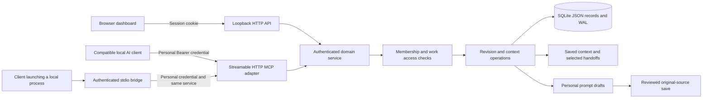
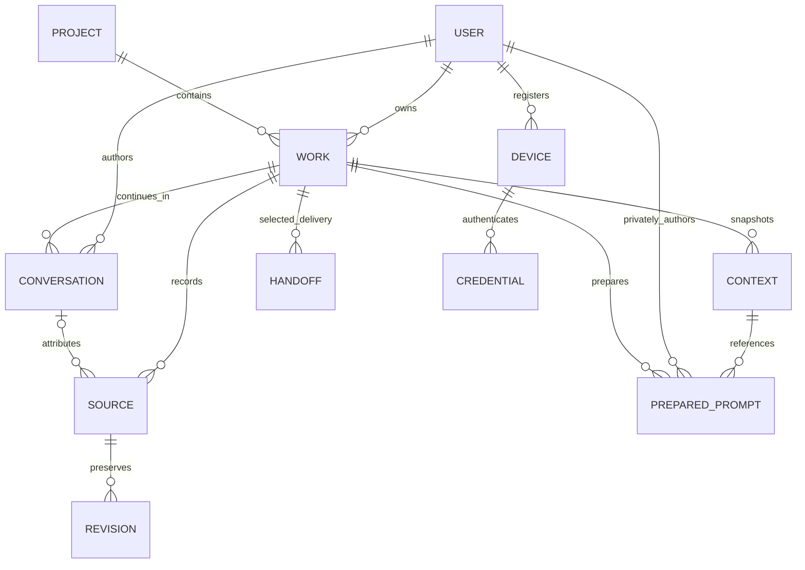
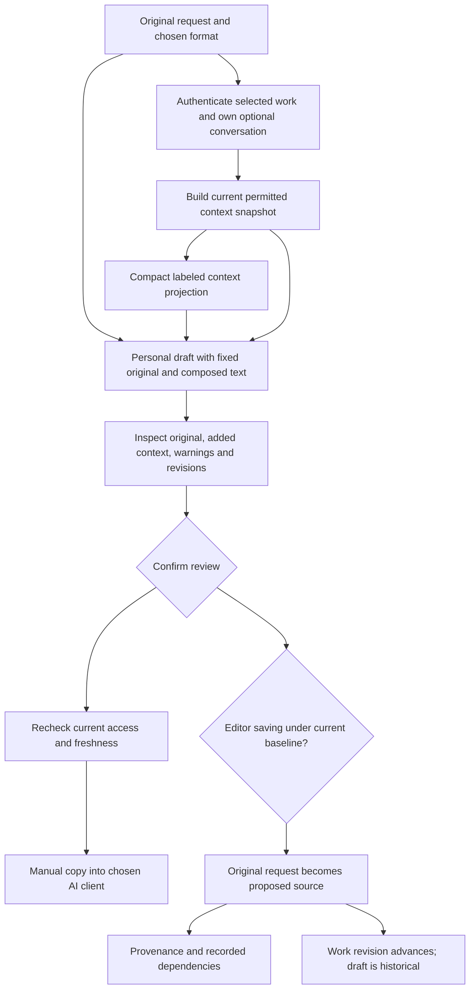
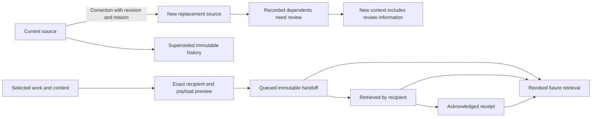
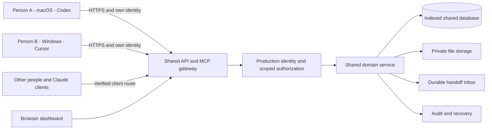
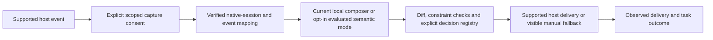
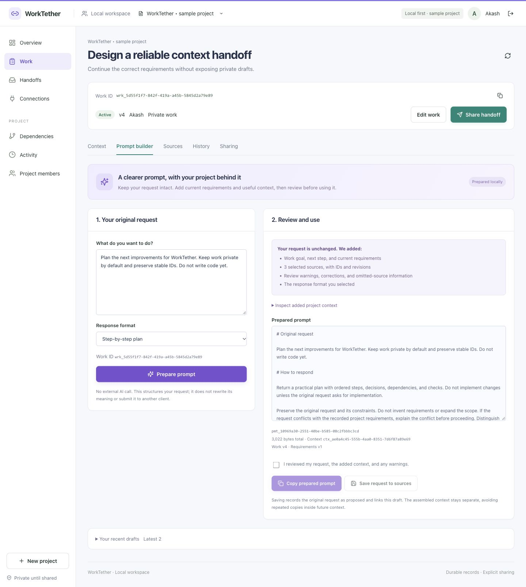

# Architecture and diagrams

Version 0.5 · 5 October 2026. Diagrams describe the current local service or explicitly labeled future components. Requirements are in [PRD](PRD.md); contracts are in [FSD](FSD.md). Mermaid source stays inside these documents for review and versioning.

## D1 — Current local architecture

**Why needed:** show where identity and permissions are enforced, and why changing AI clients should not change project rules.



The browser is presentation, not the authority. MCP dispatches the same domain operations. Local files and the SQLite database are trusted operator resources. Source/handoff text remains untrusted content. The stdio bridge is a transport adapter, not native chat capture. The local original-preserving composer shares domain permissions; no native chat adapter, external AI optimizer, or automatic delivery is present.

## D2 — Explicit MCP continuation today

**Why needed:** demonstrate what happens after connection and which steps actually create conversation identity.

```mermaid
sequenceDiagram
  actor U as Person
  participant C as AI client
  participant M as WorkTether MCP
  participant D as Domain store
  U->>C: Select project and Work ID
  C->>M: workspace_overview / list_work
  M->>D: Check authenticated access
  D-->>C: Permitted records
  U->>C: Start a WorkTether conversation
  C->>M: create_conversation(workId, title)
  D-->>C: Conversation ID
  C->>M: record_source(selected prompt, conversationId)
  D-->>C: Source ID and revision
  C->>M: get_work_context(workId, budgetBytes)
  D-->>C: Context ID, current revisions, warnings
  U->>C: Continue and review result
  C->>M: record_progress(expectedRevision)
  alt Revision remains current
    D-->>C: Updated work revision
  else Another change committed
    D-->>C: Conflict; retrieve and reconcile
  end
```

Tool invocation depends on the client and the person's workflow. Merely adding the server does not trigger all these calls or capture all prompts.

## D3 — Identity model

**Why needed:** distinguish durable work, conversations, sources, and client transport connections, so a new chat does not become a new project by accident.



Sources may omit conversation linkage today. Conversation metadata follows work read access, while recording against a conversation requires its owner attribution. Native session mappings are proposed separate records scoped by deployment, person, integration, and native session identity. An MCP transport session ID is not included as durable work identity.

## D4 — Implemented local prompt preparation

**Why needed:** show what gets persisted, how current authorized context is added, and why copying and saving are separate actions.



Method `worktether-local-2` runs without external AI calls. The full context remains stored separately from the added projection. Personal draft content is fixed; save-link metadata is updated after explicit save. The original-source save avoids nesting full assembled context into later context. Its source follows work permissions; the full draft remains author-private. Draft freshness compares current work/project baselines. [PROMPT_BUILDER.md](PROMPT_BUILDER.md) describes review/access gates and limits.

## D5 — Correction and delivery lifecycle

**Why needed:** show why deleting a mistaken prompt is insufficient, and why receipt does not mean work completion.



Recorded edges determine review propagation. Already copied handoff/context text cannot be withdrawn from another model or person. Handoff staleness and review warnings complement the retained payload.

## D6 — Shared hosting target, L3

**Why needed:** explain collaboration across many machines without peer-to-peer credentials or database-file synchronization.



Every request is attributed to a person. Work grants and selected deliveries remain distinct. Cloud-origin clients need a network-reachable verified route; local 127.0.0.1 cannot be reused as a shared endpoint. [HOSTING.md](HOSTING.md) defines migration and deployment gates.

## D7 — Future native adapter and semantic assistance

**Why needed:** keep host capture/delivery capabilities visibly separate from the implemented manual composer.



All native-event, consent-registry, semantic-mode, decision-registry and host-delivery components in D7 remain planned. A hook that adds context is not assumed to rewrite arbitrary prompts. Host timeout/truncation and model-quality evidence require separate tests; see [integrations](INTEGRATIONS.md).

## UI and chart interpretation

The [refined dashboard](assets/dashboard-refined.jpg) and [local prompt builder](assets/prompt-builder-local.jpg) show the version 0.4 browser using sample records. Earlier [dashboard](assets/dashboard-local.jpg) and [mobile connections](assets/connections-mobile.jpg) screenshots remain historical evidence. The [dashboard concept](assets/dashboard-concept.png) and [connection concept](assets/connection-concept.png) are design references, not observed connected machines.




The evidence chart counts readable current project records in explicit evidence states. It measures recorded evidence state, not model accuracy. The graph is a bounded recorded neighborhood: current limits are 80 nodes and 160 edges. A readable relationship list complements the visualization. The current Prompt builder exposes preserved original input, exact added context, warnings/provenance, and complete generated text. It has no quality score. Semantic changed-span diffs and native capture/mapping status remain future work. The responsive redesign uses clearer navigation, vibrant accents, short interaction transitions and reduced-motion support; formal accessibility certification is pending.

The current [conversation screen](assets/conversation-tracking.jpg) and [laptop setup](assets/laptop-setup.jpg) add explicit attribution and named local registrations. [CONVERSATION_TRACKING.md](CONVERSATION_TRACKING.md) diagrams how several chats continue one Work ID; [DESIGN_SYSTEM.md](DESIGN_SYSTEM.md) describes reusable presentation components. These additions do not install automatic native adapters or establish shared hosting.

## Architecture decisions

| Decision | Reason / tradeoff |
| --- | --- |
| One shared authoritative service | Stable identity and consistent access; operator availability becomes a dependency. |
| MCP plus browser | Broad tool access with a consistent full UI; host-specific capabilities still differ. |
| Explicit capture first | Less accidental collection; more deliberate user effort until adapters prove useful. |
| Immutable snapshots and revisions | Reviewable state and safe conflict handling; archive storage grows. |
| Bounded deterministic context | Inspectable selection and preserved constraints; weaker relevance than a proven semantic retriever. |
| Local original-preserving composition | No external provider dependency; inspectable additions and private draft identity. Semantic rewrite/quality improvement is unproven. |
| Save original instead of envelope | Prevents repeated nested packages; full personal draft and provenance remain retrievable separately. |
| Local SQLite prototype | Simple durable start; JSON scans need replacement before large hosted use. |
| Git separate from context history | Code remains in repository versions; future links connect intent to commits without replacing Git. |
