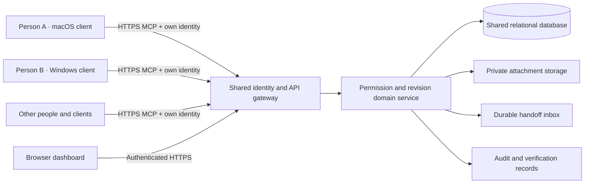

# Path to shared hosting

Status: planned L3 architecture, updated 5 October 2026. Start with the [deployment runbook](deploy.md) for current local setup, the unverified private SSH pilot and gated public deployment steps. Related: [PRD](PRD.md), [architecture diagrams](ARCHITECTURE.md), [integration routes](INTEGRATIONS.md), [guardrails](GUARDRAILS.md), and [roadmap](ROADMAP.md).

The local release deliberately binds to `127.0.0.1`, accepts loopback hosts and trusted local browser origins, and uses local passwords and static credentials. It is not a public deployment configuration. To collaborate from several physical computers, deploy **one shared service**; each person authenticates, registers their clients and connects to its HTTPS MCP endpoint. Do not attempt to synchronize independent SQLite files between laptops.

## Target architecture

Devices identify connection locations; authenticated people own work. Projects define membership. Read/edit grants and selected handoffs are distinct. A shared MCP installation is not authorization to read every person's work or run code on their machines.

Local Codex/Cursor/Claude Code clients and cloud-origin chat connectors have different network paths. Certify each claimed route against the hosted endpoint with the correct personal identity. Local explicit prompt preparation is implemented. Shipping one URL does not implement automatic native chat mapping, prompt interception or delivery; those remain separate adapter features.

## Migration sequence

1. **Identity and transport:** configure a reviewed identity provider and the official MCP OAuth authorization flow, including protected resource metadata, resource/audience validation, PKCE and appropriate scopes. Keep the browser session and MCP authorization separate. Replace the local Host/Origin configuration with explicit public HTTPS hosts and origins. Configure secure cookies and proxy trust for the known reverse proxy. Do not simply change the listen address to `0.0.0.0`.
2. **Data model:** replace the local JSON record adapter with indexed relational tables for users, memberships, work, sources, revisions, conversations, contexts, grants, edges and handoffs. Keep expected-revision updates and handoff idempotency atomic. The local store currently scans records in memory; bounded output does not imply indexed storage at large scale.
3. **Migration:** stop local writes, take a consistent backup, export records, preserve existing IDs/revisions, validate relationships, import into staging, and compare counts and permission-filtered continuation results. Rotate/revoke local static credentials rather than migrating their authority to a public service. Retain the backup for rollback.
4. **Files:** move attachments into private object storage with size/type validation. Check authorization before issuing short-lived downloads; introduce upload scanning and lifecycle controls appropriate to the deployment. Preserve selected handoff file access independently of underlying work grants.
5. **Team lifecycle:** add invitations, accepted membership, member removal, account recovery, session management, credential expiry/rotation and organization policies. Existing private work must remain private even to project administrators unless an explicit policy says otherwise.
6. **Operations:** use HTTPS, durable backups with restore drills, centralized audit records without secrets, per-principal rate limits, request-size limits, health checks, resource monitoring and retention/deletion policies. Introduce a queue/pub-sub service only when multiple application instances or notifications need it; handoff delivery remains stored before acknowledgement.
7. **Verification:** rerun isolation, revocation, revision conflict, snapshot, idempotency and restart tests against the hosted adapter. Test real clients on macOS and Windows, external network latency, concurrent writes, attachment traffic, backup restoration and recovery. Record which client supports each capability.
8. **GitHub next:** use an installation-scoped GitHub App with minimum repository permissions. Link work/results to repository, branch and commit IDs. Verify webhook signatures, deduplicate deliveries and enforce project authorization. Git remains the code history; WorkTether remains the requirements, decisions and collaboration history.

## First hosted pilot

Start with one deployment, a small invited team, explicit project membership and one repository. Maintain the same Work IDs when moving between clients. Exercise: retrieve current context → change requirements → flag linked work → review evidence → send selected handoff → acknowledge → revoke → retrieve again. A successful read must use the currently authorized identity, not merely possession of a record ID.

The documented local benchmark is a starting measurement, not a hosted performance promise. Re-measure permission-filtered listings, context assembly, inbox latency and correction propagation with realistic source sizes and tenancy. Evaluate queues, database indexes and partitioning from those measurements.

## Boundaries that remain

- A recipient can copy content already read; revocation controls future service retrieval.
- A correction cannot erase an active model's prior context. The client must retrieve and inspect current context before continuing.
- Recorded dependency edges identify recorded impact; they do not reveal every influence on a model.
- MCP exposes operations. Automatic notifications, embedded UI and remote execution require separately implemented client capabilities and authorization.

Protocol references: [MCP authorization](https://modelcontextprotocol.io/specification/latest/basic/authorization), [official TypeScript SDK HTTP serving](https://github.com/modelcontextprotocol/typescript-sdk/blob/main/docs/serving/http.md), and [official SDK authorization guidance](https://github.com/modelcontextprotocol/typescript-sdk/blob/main/docs/serving/authorization.md). Use the exact SDK version pinned in the lockfile when implementing the adapter and recheck the specification during hosting work.
