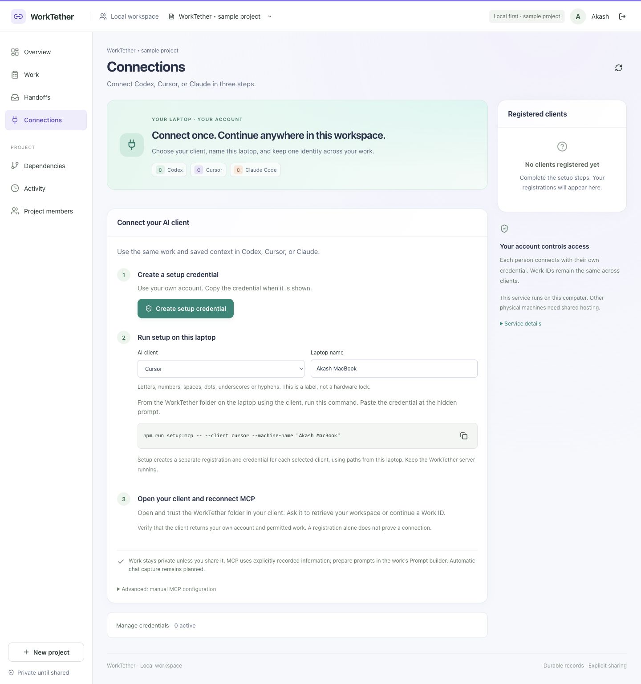

# Set up MCP on a specific laptop

Version 0.5 · 5 October 2026. The implemented profile runs locally on the laptop that launches the AI client. The setup generator calculates that laptop's Node, loader, bridge and credential paths.

## First local setup

1. Put WorkTether in a stable folder on the target laptop. Install Node.js 22.13 or newer, then run these commands from that folder:

```sh
npm ci
npm run build
npm start
```

2. Open `http://127.0.0.1:4318`, sign in with your own account, then open **Connections** and select **Create setup credential**. Copy it when revealed.
3. In a second terminal on the same laptop, run:

```sh
npm run setup:mcp -- --client all --machine-name "Akash MacBook"
```

4. Paste the credential at the hidden terminal prompt. Setup creates separate client registrations and credentials. Open/trust the appropriate project config and reconnect MCP in the client.
5. Ask the client for `workspace_overview`. Check your actual returned identity and permitted work, then follow [conversation tracking](CONVERSATION_TRACKING.md).

The dashboard's **AI client** and **Laptop name** fields build this command for you. Names allow 1–64 characters: letters, numbers, spaces, dots, underscores or hyphens. Omit the name to use `this machine`. It labels registrations and credential metadata; it is not hardware attestation, a project-scoped token, or a lock preventing copied credentials from being used elsewhere.



## Choose a client

| Choice | Command option | Generated configuration |
| --- | --- | --- |
| Codex | `--client codex` | `.codex/config.toml` |
| Cursor | `--client cursor` | `.cursor/mcp.json` |
| Claude Code | `--client claude-code` | `.mcp.json` |
| Claude Desktop | `--client claude-desktop` | `.worktether/claude-desktop-config.json`; merge its entry into Desktop's local config, then restart Desktop. |
| All four | `--client all` | All entries, with separate credentials. |

Examples:

```sh
npm run setup:mcp -- --client cursor --machine-name "Maya Windows"
npm run setup:mcp -- --client claude-code --machine-name "Ravi MacBook"
npm run setup:mcp -- --help
```

The same npm command can be used from PowerShell after changing into the local WorkTether folder. If PowerShell blocks the `npm.ps1` launcher, use `npm.cmd` rather than weakening execution policy. Physical Windows/client certification remains pending; the implementation constructs platform-local paths.

Do not rerun setup over an activated credential file. It deliberately refuses replacement. For reconfiguration, inspect Connections, revoke the old client registration, and review/remove only the old WorkTether entry and its credential file before rerunning. Preserve other MCP servers.

## Use WorkTether from another project folder

Generated Codex/Cursor/Claude Code files are scoped to the WorkTether folder. Merely running setup there does not install MCP into every repository.

For another repository on **the same laptop**, merge only the generated `worktether` entry into that repository's appropriate client config. Keep its absolute launch/credential paths pointing to the WorkTether installation. Preserve unrelated entries. Open/trust that repository as required and verify identity/tools again. The repository directory and WorkTether's Project ID are different concepts; select the intended Project/Work IDs explicitly.

For personal availability across projects, use the client's supported user/global configuration route. This setup CLI does not edit global settings. Codex supports trusted project or personal config; Cursor supports project or personal `mcp.json`; Claude Code distinguishes local/project/user scopes. [Codex configuration](https://learn.chatgpt.com/docs/extend/mcp?surface=cli), [Cursor configuration](https://prod.cursor.com/docs/mcp), [Claude Code scopes](https://code.claude.com/docs/en/mcp).

## Custom local port

If another application uses 4318, choose a free local port and configure both the server and allowed browser origin. On macOS/Linux, from the WorkTether folder:

```sh
PORT=4420 WORKTETHER_ORIGINS=http://127.0.0.1:4420,http://localhost:4420 npm start
```

On Windows PowerShell:

```powershell
$env:PORT = '4420'
$env:WORKTETHER_ORIGINS = 'http://127.0.0.1:4420,http://localhost:4420'
npm.cmd start
```

Open `http://127.0.0.1:4420` and create the setup credential there. Run setup with the corresponding **service origin**, without `/mcp`:

```sh
npm run setup:mcp -- --client codex --machine-name "Akash MacBook" --url http://127.0.0.1:4420
```

The bridge appends `/mcp`. Process environment is explicit; WorkTether does not automatically load `.env`. Add only the local frontend origins you actually use if running Vite separately.

## Another physical laptop and shared projects

Installing another independent local service is possible, but it creates a separate database/workspace. Copying personal configs or SQLite files is not a collaboration solution. `127.0.0.1` always refers to the machine executing the client or bridge; a cloud executor cannot reach this laptop through that address.

The [deployment guide](deploy.md) documents a private SSH pilot that keeps one shared service on loopback; the separate-machine procedure has not been certified. The shared-hosting target uses one reachable HTTPS API/MCP service, production identity, indexed storage, backups and per-person authorization. Work IDs remain in the authoritative shared database. Direct HTTP clients can use personal hosted OAuth without a local WorkTether backend; using a local bridge instead requires separately implemented hosted enrollment compatibility. The bridge accepts an HTTPS origin, but it currently supports static credentials rather than OAuth login/renewal. [HOSTING.md](HOSTING.md) records the required work.

## Verify and recover

- Confirm the client discovers 20 WorkTether tools and `workspace_overview` returns your account. A registration label alone is insufficient.
- Start a conversation and retrieve context for a permitted Work ID. Check IDs and revisions.
- Keep the service running. After moving WorkTether or replacing Node, inspect/regenerate absolute config paths and verify again.
- Setup credentials may be revoked after successful provisioning; each client credential is separate. Revoke a lost client credential/registration from Connections.
- Keep ignored `.worktether/connections/` files private and local. They contain plaintext tokens; POSIX permissions are restricted, while Windows ACL verification remains pending.
- On 401, check the personal credential and revocation. On connection refusal, check the service/port and whether the executor is local. On a config conflict, review the existing entry instead of overwriting it.

No personal credential has been activated in Codex, Cursor or Claude merely by adding this documentation. Actual host certification remains a separate check in [INTEGRATIONS.md](INTEGRATIONS.md).
