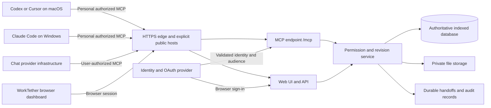

# Deploy WorkTether and connect an AI client

Documentation version 0.6 · 5 October 2026. Applies to the current application version 0.1.0. Official client/protocol references were checked on this date; configuration support is not certification in the actual client.

**Today you can run WorkTether locally and connect through its authenticated MCP tools. Public deployment needs implementation work before launch.** This repository has no production hosting profile, OAuth adapter, Docker image, cloud deployment manifest, published npm package or established public service URL. This guide does not mean a service has been deployed.

Use this sequence:

1. [Connect on one laptop](#1-run-and-connect-on-one-laptop) to verify the workflow.
2. Optionally [try a private shared pilot](#2-private-shared-pilot-over-ssh) with one authoritative database and trusted participants.
3. Complete the [public deployment requirements](#3-build-the-public-hosting-profile), then [deploy and verify](#4-deploy-the-hosted-release-step-by-step).
4. Give users the [hosted connection instructions](#5-connect-to-the-hosted-mcp-from-chat-or-an-editor) and [conversation workflow](#6-use-worktether-in-a-conversation).

## Choose the right route

| Route | What the user connects to | State / use |
| --- | --- | --- |
| Own laptop | `http://127.0.0.1:4318/mcp` or the generated local stdio bridge | Implemented; SDK-tested on this Mac. Actual third-party client and physical Windows certification pending. |
| Private shared pilot | Local SSH forward to one operator's loopback service | Documented procedure using the existing server; end-to-end remote-machine verification pending. Intended for a small trusted group. |
| Public shared service | Operator's stable HTTPS origin with `/mcp` | Planned. Requires hosted identity, authorization, storage and operational changes below. |
| ChatGPT web or Claude remote connector | Endpoint reachable from the provider's infrastructure, with supported authentication | Hosted route pending. The user's laptop address or SSH forward is not that endpoint. |

For shared work, install client connections on many laptops but run **one authoritative WorkTether service**. Independent local databases are independent workspaces. Git can share code and public configuration templates; it must not synchronize active databases or personal credentials.

Public means the service is reachable on the internet. Project records still require personal authorization. Publishing a URL must not publish private work or introduce one shared administrator token.

## 1 Run and connect on one laptop

### Step 1 — Obtain and build the project

Obtain the WorkTether source from the maintainer's actual repository or release archive. No repository URL or package registry is established in this checkout. Install **Node.js 22.13 or newer**, open a terminal in the `WorkTether` folder, and run:

```sh
npm ci
npm run build
```

Use the lockfile. The current `npm start` uses `tsx`, which is a development dependency, so this release requires the full install; `npm ci --omit=dev` is insufficient. `npm run build` checks TypeScript and builds the browser UI; it does not produce a compiled backend artifact.

### Step 2 — Start your own database

For a clean account without demonstration users, start with a **new** database path. On macOS/Linux:

```sh
WORKTETHER_SEED=false WORKTETHER_DB=data/personal.sqlite npm start
```

On Windows PowerShell:

```powershell
$env:WORKTETHER_SEED = 'false'
$env:WORKTETHER_DB = 'data/personal.sqlite'
npm.cmd start
```

Open `http://127.0.0.1:4318`, create your own account, and create a project and work item. Keep the server running. Disabling seeding does not remove demonstration accounts already in an existing database. Process environment is explicit; a `.env` file is not loaded automatically. See the [settings template](examples/local.env.example).

### Step 3 — Provision your client connections

In **Connections**, select **Create setup credential**. In a second terminal on the same laptop, from the WorkTether folder, run:

```sh
npm run setup:mcp -- --client all --machine-name "My Laptop"
```

Paste your setup credential at the hidden prompt. Choose `codex`, `cursor`, `claude-code`, or `claude-desktop` instead of `all` for one client. Setup creates separate personal credentials and registrations for the selected clients.

| Client | Next action |
| --- | --- |
| Codex | Open/trust the folder containing generated `.codex/config.toml`, reconnect, and inspect MCP availability. |
| Cursor | Open the folder containing `.cursor/mcp.json`, enable the server in MCP settings, and reconnect. |
| Claude Code | Open the folder containing `.mcp.json`, approve the project server, and inspect `/mcp`. |
| Claude Desktop local server | Merge the generated entry from `.worktether/claude-desktop-config.json` into Desktop's local configuration, preserving other servers; restart Desktop. |

Ask the client to call `workspace_overview` and show the returned identity. Confirm your account and the current **20-tool catalog**. A file being generated does not establish a working connection. After successful setup, revoke the temporary setup credential if desired; the new client credentials are separate.

Keep `.worktether/connections/` private. Its ignored files contain plaintext credentials; POSIX permissions are restricted, and Windows ACL validation remains pending. Setup does not modify global client settings. For another project folder, custom ports, moved installations and Desktop's merge step, use [laptop setup](LAPTOP_SETUP.md) and [integrations](INTEGRATIONS.md).

## 2 Private shared pilot over SSH

This route lets a trusted group try one shared service while it stays bound to loopback. It is a temporary pilot procedure, not the public hosting profile. It needs a maintained SSH host, authorized forwarding, personal SSH access and an operator responsible for data and uptime. SSH transport does not add tenant isolation, OAuth, account recovery or production capacity to WorkTether.

### Step 1 — Operator prepares one host

Install the source and supported Node runtime on a trusted server. Build from the WorkTether folder with `npm ci` and `npm run build`. Use a fresh database on persistent local storage owned by the service account. Restrict operating-system access to the database; people with server/filesystem administration access can read its contents.

Start the service on that host, with the frontend origins users will access through their forwards:

```sh
WORKTETHER_SEED=false WORKTETHER_DB=data/shared-pilot.sqlite WORKTETHER_ORIGINS=http://127.0.0.1:4318,http://127.0.0.1:4420 npm start
```

Keep the process running for the session; a supervised service and restart policy require separate operator configuration. Do not open port 4318 to the internet. Provision SSH access per person, ideally forwarding-only access restricted to this loopback destination rather than general shell/database access.

### Step 2 — Each participant opens a local forward

On their own laptop, with an SSH client installed and approved access to the server:

```sh
ssh -N -o ExitOnForwardFailure=yes -L 127.0.0.1:4420:127.0.0.1:4318 teammate@server.example
```

Replace `teammate@server.example` with the participant's actual SSH account and host. Verify the host key through the operator. Keep this terminal open. The explicit `127.0.0.1` binding keeps the forwarded port local to that laptop. If 4420 is occupied, choose another free port and have the operator add its exact browser origin. [OpenSSH forwarding reference](https://man.openbsd.org/ssh).

### Step 3 — Create personal WorkTether connections

Open `http://127.0.0.1:4420` on the laptop. Create/sign in to your **own** WorkTether account and generate your setup credential. Obtain the same application release on the laptop and run `npm ci` for its bridge; do not start an independent WorkTether server there. From its local WorkTether folder:

```sh
npm run setup:mcp -- --client all --machine-name "My Laptop" --url http://127.0.0.1:4420
```

`--url` is the **service origin without `/mcp`**. The bridge appends that path. Absolute launch paths are generated for the laptop running setup. Each participant does this separately and keeps their credentials locally.

### Step 4 — Verify collaboration and recovery

The owner adds collaborators through **Project members**. Membership does not make private work readable. Grant access to selected work, choose project visibility deliberately, or send a selected handoff. Check that another participant can retrieve granted content and cannot retrieve a different person's private work. Continue the same Work ID from another laptop, record progress with the current revision, and test credential revocation.

All participants retrieve records from the host's single database. Keep a consistent backup using SQLite online backup or stop the service before copying its database. Do not copy a live database file alone while writes/WAL records may be outstanding. Test restore to a separate isolated installation. Disconnecting the SSH forward stops client access; records remain on the host.

This exact multi-machine procedure has not been executed in the recorded validation. Shared forwards also appear as loopback traffic to the existing IP limiter; its local limits do not establish fair per-person rate limiting. Claude cloud connectors and ChatGPT web cannot reach a participant's local forward.

## 3 Build the public hosting profile

**Complete this section before using section 4.** These are required changes to the current product, not environment switches already supported by it. The existing `PORT`, `WORKTETHER_DB` and `WORKTETHER_ORIGINS` variables do not enable public hosting.

### Target architecture



An AI host discovers tools and invokes them with a user's authorization. A model on its own does not install MCP or open a network connection. Hosts without MCP support need a separately implemented adapter/tool runner. The WorkTether dashboard is currently a browser application, not an embedded MCP Apps interface.

### Required implementation work

| Area | Current behavior | Hosted release must add |
| --- | --- | --- |
| Network profile — [HTTP service](../server/index.ts) | Hardcoded loopback binding and loopback Host allowlist | Explicit hosted bind/host configuration, exact HTTPS origins, strict known-proxy trust and TLS-aware requests. Preserve the local profile. |
| MCP authorization — [HTTP service](../server/index.ts), [MCP adapter](../server/mcp.ts) | Static personal credentials; no OAuth discovery | Reviewed identity integration, MCP protected-resource discovery, issuer/audience/expiry validation, scoped authorization, refresh/revocation and client registration/callback interoperability. |
| Browser sign-in — [HTTP service](../server/index.ts) | Local passwords, open registration, cookie without `Secure` | Hosted account lifecycle and policy; secure cookies, session controls, CSRF/origin handling, recovery and invited-user enrollment for the pilot. |
| Data — [store](../server/store.ts) | One workspace; JSON records in SQLite with scans | Indexed shared schema, atomic revisions/idempotency, migrations and tested isolation. Add organization/tenant boundaries before serving independent organizations. PostgreSQL is a proposed target, not an existing adapter. |
| File access — [store](../server/store.ts), [HTTP service](../server/index.ts) | Attachments in local records, permission-checked API retrieval | Private durable storage, authorized downloads, upload validation, retention and deployment-appropriate scanning. |
| Client enrollment — [setup script](../scripts/setup-mcp.ts), [stdio bridge](../server/stdio.ts) | Static credential provisioning through local APIs | Hosted enrollment/OAuth compatibility. The existing CLI accepting an HTTPS origin does not implement OAuth sign-in or token renewal. |
| Operations and lifecycle | Local health response and in-memory login limiter | Dependency-aware readiness, per-principal/request limits, monitoring, redacted audits, backup/restore, member removal, export/deletion policies and incident recovery. |
| Runtime packaging — [package](../package.json) | Source backend starts through development `tsx` | A tested production artifact/runtime dependency policy, process supervision and platform deployment configuration. |

Follow the current [MCP authorization specification](https://modelcontextprotocol.io/specification/2026-07-28/basic/authorization): use protected-resource and authorization-server discovery, PKCE, resource-bound tokens and validated authorization responses. Check each intended client's supported registration mechanism, including published client identities or pre-registration; do not require one unsupported registration path for all clients. OAuth scope checks complement record-level permissions; possession of a Work ID never grants access.

Choose this hosted product's identity and permission policy before adding public signup. A token should be limited to the intended operations/projects, and every tool must enforce that policy. Current static credentials follow the person's permitted account authority; they are not narrowly project-scoped. Local tokens should be revoked and replaced during migration.

Changing the bind address, adding a public origin, publishing a frontend-only build, or placing a tunnel/proxy in front of this release does not complete these requirements. A proxy that rewrites a public Host to loopback can defeat the local boundary. Use an explicit reviewed hosted profile rather than that workaround. See [hosting architecture and migration](HOSTING.md) for the detailed domain plan.

## 4 Deploy the hosted release step by step

These steps apply **after section 3 is implemented and verified**. They are an operator runbook for the future hosted artifact. They are not a working one-command public deployment of version 0.1.0.

### Step 1 — Choose infrastructure and release boundaries

Use a maintained VM or container application platform that can run the Node backend, provide HTTPS, support streaming HTTP when required by clients, and connect to durable storage. Static website hosting alone cannot run `/mcp`. Begin with one application deployment and a small invited team; measure concurrency before adding instances. See [streaming/proxy guidance](https://developers.openai.com/plugins/deploy/troubleshooting).

Choose a domain you own and a stable endpoint. Throughout the remaining examples, `https://worktether.example` is an **illustrative placeholder**, not an existing service:

| Address | Purpose |
| --- | --- |
| `https://worktether.example/` | Browser dashboard |
| `https://worktether.example/mcp` | Streamable HTTP MCP tools |
| `https://worktether.example/api/health` | Existing liveness path; dependency readiness must be added |
| Discovery URL advertised in the authorization challenge | Hosted protected-resource metadata; not implemented in the current release |

Keep the UI/API on the same origin initially to simplify browser sessions. Authentication provider endpoints may be separate. Record the actual domain, release revision, runtime version, owner and restore procedure in the deployment's private operations record.

### Step 2 — Provision staging and identity

Create isolated staging compute, database and private file storage. Configure HTTPS/DNS and the exact allowed host/origin/proxy policy implemented in the hosted profile. Configure the identity provider, authorization discovery, requested scopes and each client's accepted callback/registration method.

Keep database access details and server-side secrets in the hosting platform's secret facility. Do not put client bearer tokens in frontend bundles, README examples, prompts or Git. Use personal user authorization; do not substitute a shared service administrator credential for team members.

No hosted environment-variable contract is defined in this release. Document the actual settings alongside the hosted implementation; do not assume names such as `DATABASE_URL` or `PUBLIC_URL` currently work.

### Step 3 — Build and start the hosted artifact

Pin the release and Node version, install from the lockfile, run `npm test` and `npm run build`, and build the new production backend artifact according to the implemented packaging. Configure the platform supervisor, working directory, readiness, shutdown grace period and restart policy. Ensure static assets, backend and database migrations belong to the same release.

Verify `/mcp` routes to the backend rather than the SPA fallback. The edge must preserve authorization and necessary MCP headers and response behavior. Apply stream-compatible timeouts and buffering settings if the selected transport emits streaming responses. The exact container/VM command depends on the still-to-be-built hosted artifact; no Dockerfile or cloud manifest is provided today.

### Step 4 — Migrate and restore-test data

For a fresh service, create its schema without sample accounts. For existing work, stop writes, take a consistent backup, preserve IDs and revisions in the migration, validate relationships and permission-filtered results in staging, and rotate local credentials. Migrate files with their access rules. Never merge unrelated SQLite workspaces by copying files over one another.

Restore the backup into an isolated environment and check work, conversations, corrections, context snapshots and selected handoffs. Keep the earlier artifact/data backup available for rollback. Any destructive schema migration needs its own reviewed rollback/data-recovery plan.

### Step 5 — Exercise external clients and authorization

Use [MCP Inspector](https://modelcontextprotocol.io/docs/tools/inspector) and actual intended clients from outside the server's network. Verify MCP initialization, the expected tool catalog and authenticated `workspace_overview`; opening `/mcp` in a browser is not an MCP test. Test:

- Unauthenticated requests receive an appropriate authorization challenge; missing/expired/wrong-audience/revoked tokens cannot access private content.
- Two personal identities retrieve only permitted work and drafts. Wrong Project/Work/Conversation IDs and cross-organization attempts are denied.
- One Work ID continues across macOS and Windows; new chats get separate Conversation IDs. Simultaneous updates produce a revision conflict, not silent overwriting.
- Corrections, source exclusion, historical snapshots, handoff selection/acknowledgement and subsequent revocation behave as documented.
- Credential refresh, reconnect, restarts, slow connections, limits and restore recovery work for each claimed client/version.

The existing local smoke scripts use local account/password and static-credential provisioning. They are useful for local regression but are **not** a hosted OAuth acceptance suite. Add hosted tests and redacted evidence to [validation](VALIDATION.md).

### Step 6 — Release an invited pilot, then public enrollment

Deploy the tested release to production, run migrations according to the tested plan, repeat the external authentication checks and invite a small team. Watch error rates, latency, storage growth, revision conflicts and access denials without logging private prompts or tokens. Roll back on isolation, auth or data-integrity failures.

Expand public enrollment only after identity/tenant isolation, removal/recovery, abuse limits, privacy/retention, restore and client gates pass. Publish the real URL, supported versions, onboarding guide and operational contact. Replace illustrative URLs in user-facing installation material with the verified endpoint.

Hosting and directory listing are separate steps. Users can add a supported custom MCP endpoint without a public marketplace listing. For broad ChatGPT distribution, follow the current [OpenAI plugin submission process](https://developers.openai.com/plugins/deploy/submission); hosting does not automatically install or approve a plugin. WorkTether has not been submitted or listed.

## 5 Connect to the hosted MCP from chat or an editor

**Use only after the operator has released the hosted profile and supplied its real HTTPS URL.** The examples below assume per-person OAuth discovery is implemented. They do not work against the current static-credential localhost release. Public users using direct HTTP do not need to install the WorkTether backend or maintain a local database.

For every client: accept the intended project invitation, sign in as yourself, review requested permissions, enable the connection for the intended chat, and verify returned identity with `workspace_overview`. Choose a distinct server name when testing hosted and local connections side by side. Avoid conflicting `worktether` entries or residual local bearer headers that take precedence over OAuth.

### Codex

Add the real hosted URL under a distinct server name in the appropriate trusted project or personal config:

```toml
[mcp_servers.worktether_hosted]
url = "https://worktether.example/mcp"
```

With the Codex CLI installed, authenticate and inspect:

```sh
codex mcp login worktether_hosted
codex mcp list
```

Complete personal browser sign-in and inspect `/mcp` in the client. The desktop/IDE settings also support adding a Streamable HTTP URL and authenticating. Confirm which executor owns the connection. [Official Codex configuration](https://learn.chatgpt.com/docs/extend/mcp?surface=cli).

### Cursor

Merge this into the relevant project `.cursor/mcp.json` or personal configuration, preserving existing servers:

```json
{
  "mcpServers": {
    "worktether_hosted": {
      "url": "https://worktether.example/mcp"
    }
  }
}
```

Enable/reconnect in MCP settings and finish personal authentication. If the provider requires a pre-registered client ID, use Cursor's documented OAuth configuration and exact callback for the relevant surface. Do not embed a confidential application secret into a publicly distributed desktop config. [Official Cursor MCP guidance](https://prod.cursor.com/docs/mcp).

### Claude Code

With the CLI installed, use a personal scope for access across your repositories:

```sh
claude mcp add --transport http worktether-hosted --scope user https://worktether.example/mcp
claude mcp list
```

Open Claude Code, use `/mcp`, and complete authentication for that server. Use the documented project scope instead if you deliberately distribute a secret-free project configuration. [Official Claude Code MCP guidance](https://code.claude.com/docs/en/mcp).

### Claude web, Desktop or Cowork remote connector

In the connector settings, add a custom connector with the real HTTPS `/mcp` URL, review detected authentication and sign in with your own identity. Team administrators may need to add it first. Enable it for the chat and verify identity/tools.

These **remote** connectors reach the server from Anthropic infrastructure, including when used in Desktop. A local Desktop stdio server is a different route. Avoid a shared fixed header that grants all members the same person's account access. [Official remote connector setup and network requirements](https://support.claude.com/en/articles/11175166-get-started-with-custom-connectors-using-remote-mcp).

### ChatGPT web

If account/workspace policy permits developer mode, enable it in **Settings → Security and login**. In **Plugins**, add a connection with the real HTTPS `/mcp` URL, complete its personal authorization, and inspect discovered tools. Start a new chat and select the connection from the tools menu. Recheck the official UI instructions as the product changes.

ChatGPT web does not load local `.codex/config.toml`. OpenAI also documents Secure MCP Tunnel for private developer testing; this project has no configured tunnel integration or verified flow. It is separate from public submission and from the SSH pilot above. [Official connection/testing guidance](https://developers.openai.com/plugins/deploy/connect-chatgpt).

### An API application or another model host

Confirm that the application supports this transport, per-user authentication and tool invocation. The [OpenAI remote MCP API guide](https://developers.openai.com/api/docs/guides/tools-connectors-mcp) describes the API route. An API application must obtain and supply the correct user's authorization and handle approval, tool outputs and failures; WorkTether does not implement that application adapter. Model choice alone does not confer MCP support.

## 6 Use WorkTether in a conversation

After confirming the connection, a user can give this instruction. Replace angle-bracket placeholders with their actual IDs/labels:

```text
Use the WorkTether MCP connection. First call workspace_overview and confirm
my identity. Retrieve current context for Work ID <work-id> with
get_work_context. Report any review warnings or missing required context.

For this new chat, create_conversation for that Work ID with title
<chat-title>, client <client-name>, and machineName <my-laptop-label>.
Return the full Work ID, Conversation ID, Context ID and current revisions.
If I supply an existing Conversation ID, inspect and reuse it instead.

Preserve my original request. If I ask to prepare it, use prepare_prompt
with that Work ID, my exact request and my Conversation ID, then show the
added context and warnings for review. Do not submit it elsewhere for me.
Save only the selected decisions, evidence or progress that I authorize.
Record selected sources under my Conversation ID and preserve history.
```

Use the same Work ID for the ongoing objective. Create another Conversation ID for a new chat/client; reuse the prior ID when resuming that chat. The person authenticated to the service owns the new conversation; supplied laptop/client labels do not verify hardware or native chat identity. Ask for `list_conversations` when finding a prior record and retrieve fresh context before continuing.

Prompts, summaries and prepared drafts stay explicit. Connecting MCP does not capture every message, automatically rewrite user input, guarantee tool use or remove bias from a model. Local `prepare_prompt` preserves the request and adds structured current context; review before using it. See [conversation tracking](CONVERSATION_TRACKING.md), [prompt builder](PROMPT_BUILDER.md) and the [continuation template](examples/continuation-instruction.md).

To collaborate, the work owner shares a selected handoff or grants work access deliberately. The recipient calls `list_inbox`, retrieves the handoff and acknowledges receipt. This is durable collaboration through the service; it does not execute a prompt on someone else's laptop or automatically message their AI client.

## 7 Troubleshoot and maintain the connection

| Symptom | Check / action |
| --- | --- |
| Local connection refused | Start the local service; check the executor's machine and port. |
| SSH pilot stopped responding | Confirm the host service and local forward are running; verify host access and the chosen local port. |
| Hosted 401 or repeated sign-in | Check discovery, issuer/audience, callback, token expiry/refresh and server revocation. For local setup, check the actual personal credential. |
| 403 `INVALID_HOST` or `INVALID_ORIGIN` | The current local profile rejects that public request. Complete the hosted profile; do not disable protection or rewrite Host to conceal it. |
| Tools return permission errors | Confirm identity, project membership, work grants and draft ownership. An ID is not access. Domain failures can arrive in an MCP tool error even when HTTP succeeded. |
| `/mcp` returns dashboard HTML / 404 | Fix endpoint/path/backend routing; the UI root is not an MCP endpoint. |
| Browser or curl sees 405 | A bare GET is not MCP initialization; test using a real MCP client/Inspector. |
| Cloud chat cannot reach localhost/VPN | Its connector runs elsewhere. Use the supported reachable hosted route; local forwards are only for local clients. |
| Prompt preparation or chat tracking did not happen | Explicitly request the relevant tools/manual workflow. Native interception/mapping is not implemented. |
| Stale context or revision conflict | Retrieve latest context/revisions, inspect changes and reconcile; do not blindly retry writes. |
| Connected under the wrong account | Disable the connection, revoke its authorization, reauthenticate as yourself and verify before retrieving work. |

Before upgrades, back up consistently, test the migration/restore in staging and retain rollback artifacts. After changes to authentication or tool schemas, reconnect/refresh client metadata and rerun affected workflows. Keep secrets and private prompt content out of diagnostic screenshots/logs. Client disconnect and service-side revocation are separate controls; neither can recall text already copied.

## 8 Release evidence and next action

| Gate | Recorded status |
| --- | --- |
| Local domain tests, build and HTTP/stdio SDK smoke | Passed during application verification: 24 tests, 20 tools on each transport. See [validation](VALIDATION.md). |
| Real Codex/Cursor/Claude host workflows and physical Windows | Pending. |
| Private SSH pilot on separate machines | Procedure documented; not executed/certified. |
| Hosted profile, OAuth discovery, shared indexed adapter and lifecycle | Not implemented. |
| Public infrastructure, real service URL, restore drill and hosted client acceptance | Not provisioned or verified. |
| Public marketplace/distribution approval | Not submitted. |

The next implementation milestone is an **invited hosted pilot**: implement the section 3 profile, stage and test it, and publish a real endpoint only after the gates pass. Use [HOSTING.md](HOSTING.md) for migration design and [ROADMAP.md](ROADMAP.md) for release acceptance. This documentation revision changes no runtime behavior and deploys no public service.
